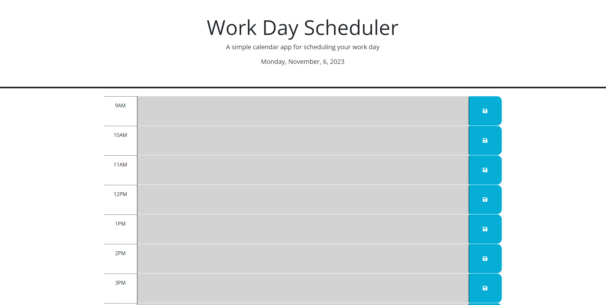

# work-day-scheduler
This is to save events for each hour of a typical workday (9:00 AM-5:00 PM).

I have a few additional sources for my code for this application:
- Class assignments
- Fellow students in my study group (Catlin Miller, Sarahy Moros, Tood Fowler, and Reagan Lowe), who very much helped with explaining portions I was stuck with.
- ChatGPT

## Website URL

https://troymena.github.io/work-day-scheduler/

## Website Screenshot

The screenshot below shows the website at the time of writing this README file:

